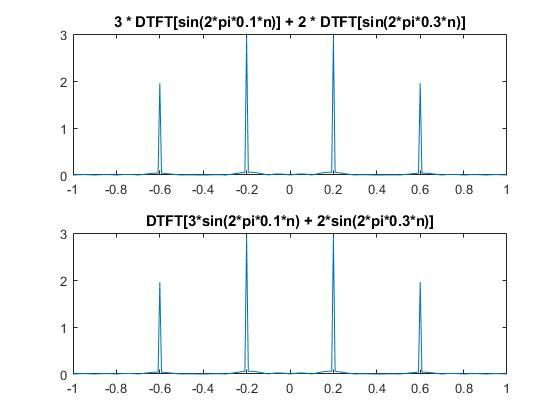
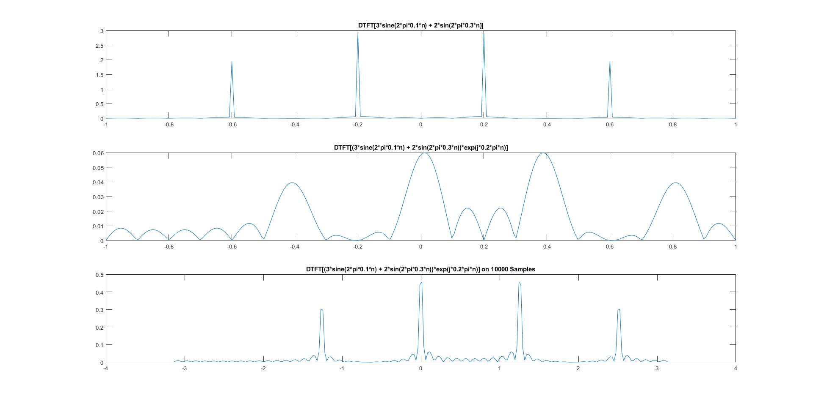
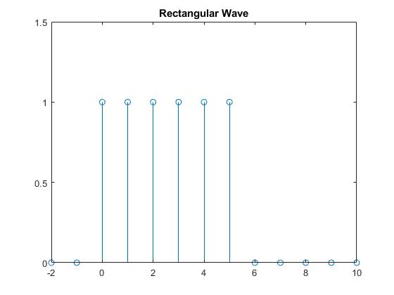
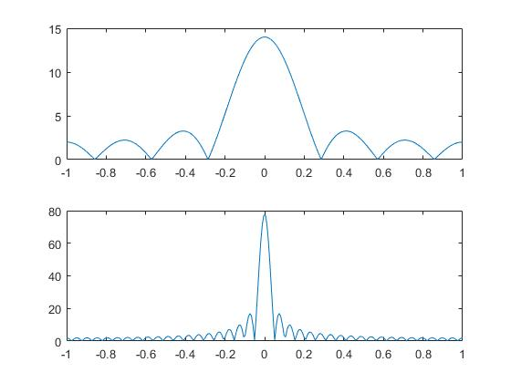
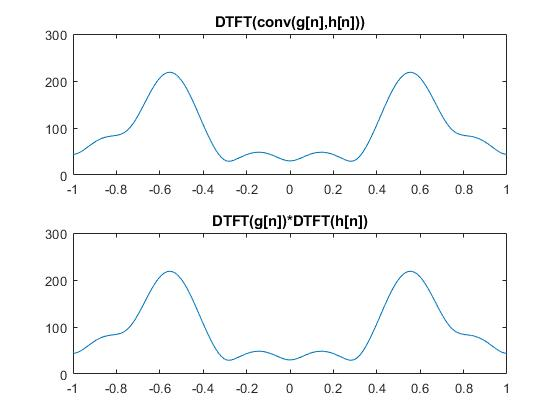
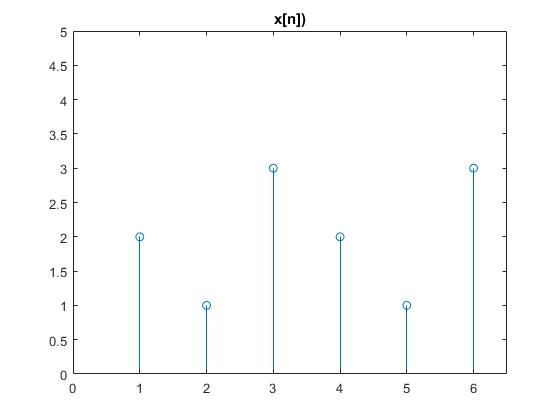
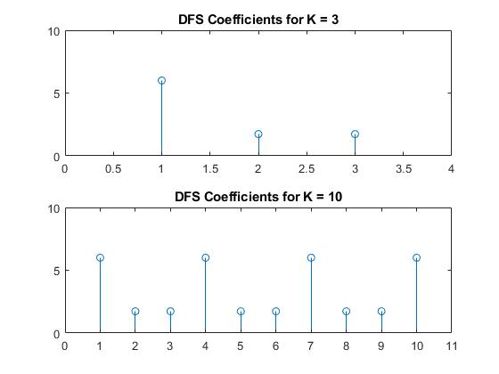

# Discrete Time Fourier Transformation (DTFT) Properties and Discrete Fourier Series (DFS) Application

In this documentation we will be looking at DTFT properties and validating them with MATLAB applications. Then, we are going to write a DFS performing function and apply it on arbitrary signals.

## DTFT Properties

In this session we will be validating some properties of the DTFT. We are going to work on:

- Linearity
- Frequency Shift
- Convolution

properties. Let's dive into it.

### Linearity Property

You can access the source code [here](./linearityproperty.m)

In theory, the linear operations must satisfy the superposition principle. For DTFT it looks like similar to Equation 1.

Equation 1.

So to validate this, we have to define two signals, take their weighted sum, and then perform a DTFT. On the other hand, we have to take the DTFT of the signals, multiply them by their weights, and finally sum them up. If two processes provide the same result then we can say linearity property is validated.

[Here](./linearityproperty.m) is the source code to perform it.

And the resultant graphs is shown in Figure 1.

*Figure 1 Linearity Property of the DTFT*

As you can easily observe two plots are the same.

### Frequency Shift Property

Frequency shift property depends on a time-domain multiplication operation. It states that multiplication of any signal with a complex exponential like e^(j * Wo * n) cause shift 'o unit to the right in the frequency domain. 

Its mathematical operation is demonstrated in Equation 2.

*Equation 2*

To validate it we are going to use the frequency response of the signal which we used in the validation of the linearity property. 

You can access the source code from [here](./freq_shift.m)

The results should be as shown in Figure 2.

*Figure 2 Frequency Shift Property of the DTFT*

As you can see there is a smearing occurs when we shifted the signal. To understand it we must understand the finite numbers of sample problem. Sinusoidal signals are periodic signals. In order to  obtain a real periodic signal we need to have infinite number of samples. But we are using a computer to represent it. So we have window the signal from certain borders. To achieve that we can multiply the signal by rectangular wave. Rectangular wave is shown in Figure 3.

*Figure 3 Rectangular Wave Example*,

So we are performing DTFT of a multiplication in time domain. We know that multiplication in time domain converts to convolution when switching to frequency domain. So we are performing Equation 3. We will be investigating this property in the next chapter.

*Equation 3*

And we know that the DTFT of the rectangular pulse is a sinc function. Sinc function defined as in Equation 4.

*Equation 4*

So we know that the first plot of Figure 2 is actually a sinc wave due to windowing effect. But the reason behind the smearing effect there is a filtering effect. Complex exponential we used is a windowed signal too (It is periodic too so to represent it we should window it). So It has a sinc component in its frequency response. So in frequency domain we are performing a convolution which has two sinc function as its inputs. This operation causes the smearing. Increasing the samples reduces its effect because the longer rectangular pulse the narrower sinc peaks as shown in Figure 4.

*Figure 4 The bottom plot is the DTFT of a longer rectangular pulse with respect to top one*

### Convolution Property

Convolution property states that the convolution in time domain turns into multiplication in frequency domain. It can be expressed as Equation 5.

*Equation 5*

In order to validate it we are going to express two arbitrary signals as g=[1 3 -5 6 9 13 -14 15 2] and h=[-1 2 3 -2 -1]. Then we are going to convolve them and take the resultant signal's frequency response and perform the DTFTs of signals seperately and multiply them. If the statement is true we will obtain the same results after both processes.

You can access the source code from [here](./convolution_prop.m)

After performing the operations we obtain the results as shown as in Figure 5.

*Figure 5 Convolution property*

As you can observe the results are the same.

## Discrete Fourier Series (DFS)

Discrete Time Fourier Transform is not applicable in real life due to two reasons. Firstly its response is not causal (because it is periodic) and secondly it is continuous. In computers we can't deal with continuous functions because they are digital machines. Then, we have a solution for the second problem. Discrete Fourier Series provide us a response which is a discrete signal. But it is still periodic.

In this chapter we are going to define a periodic signal as expressed in Equation 6 and shown as Figure 6.

*Equation 6*

*Figure 6 The signal that will be the input for DFS*

Then, we are going to write a function that operates the DFS operation which is shown in Equation 7.

*Equation 7*

where W also known as Nth Root of Unity, is defined as Equation 8.

*Equation 8*

You can find the function's source code by [here](./dfs_func.m)

As you can see we defined a nested loop in order to perform k and n iterations. And, we built the code block that performs the DFS operation.

It is time to apply our function into our predefined signal. To perform it we need to determine its period. Period of this signal is 3 samples and it is shown by N. Then we are going to decide how many bins the DFS will include. Most commonly this option is equal to sample number in one period because giving a value more than this will cause a repeated output. We are going to observe it in Figure 7.

You can access the source code by [here](./dfs.m)

As you can see we have a periodic output. Increasing the K value is not necessary.

## Conclusion

With the end of this experiment we have a better insight about properties of DTFT. How we can test them and apply them on MATLAB environment. On the other hand we have performed DFS and we wrote a DFS function we can use on further operations.

